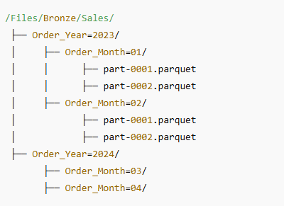
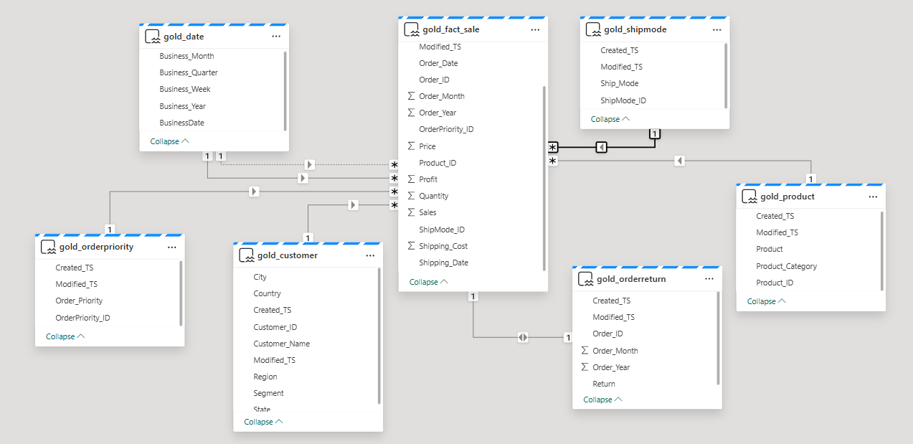

# E-commerce Lakehouse on Microsoft Fabric (Medallion Architecture)

End-to-end **Medallion Architecture (Bronze → Silver → Gold)** implemented in **Microsoft Fabric** using **Delta Lake + PySpark**, with a **Power BI semantic model** for analytics.

## ✨ Key Features
- **Incremental ingestion** with `Modified_TS` watermarking
- **Delta tables** (ACID, MERGE/UPDATE/DELETE, time travel)
- **Partitioned layout** for performance: `/Files/Bronze/Sales/Order_Year=YYYY/Order_Month=MM/`
- **Star schema** in Gold: `Fact_Sales` + dimensions (Product, Customer, ShipMode, OrderPriority, OrderReturn, Date)
- **Idempotent upserts** using Delta `MERGE`
- **Power BI** model & relationships on top of Gold

## 🪙 Medallion Layers (short)
**Bronze – Raw**  
Excel landing in OneLake → standardized → **partitioned Delta** → **incremental** by watermark.

**Silver – Transform**  
Cleansing, derived fields (`Order_Year`, `Order_Month`, `Aging`), de-dupe, business rules.

**Gold – Model**  
Star schema + semantic relationships; MERGE-based upserts for dimensions, append/merge for facts.

## 🧱 Tech Stack
- Microsoft **Fabric** (Lakehouse, Notebooks, Pipelines/Dataflow Gen2)
- **PySpark / Spark SQL**
- **Delta Lake** on OneLake
- **Power BI** (Semantic model + report)

## 📂 Project Structure
fabric-ecommerce-lakehouse/
│
├── notebooks/
│   ├── 01_bronze_ingest.ipynb          # Reads Excel files from /Files/Current and writes Bronze Delta tables
│   ├── 02_silver_transform.ipynb       # Cleanses, derives Order_Year/Month, removes duplicates
│   ├── 03_gold_model.ipynb             # Creates Gold fact and dimension tables with MERGE logic
│   ├── 04_powerbi_semantic_model.ipynb # Optional – builds Power BI relationships & model
│
├── sql/
│   ├── create_gold_tables.sql          # SQL DDL scripts for all Gold tables
│   ├── merge_patterns.sql              # MERGE queries for incremental updates
│
├── images/
│   ├── partition_fabric.png            # Bronze layer partitioning view
│   ├── semantic_model_fabric.png       # Gold star schema model
│   ├── lakehouse_view.png              # Fabric Lakehouse view
│   └── pb_insight.png                  # Power BI visual insight
│
├── pipelines/
│   └── data_pipeline_sample.json       # (Optional) Fabric pipeline JSON for automated ingestion
│
├── docs/
│   └── architecture.md                 # Notes on Medallion architecture & design decisions
│
├── samples/
│   └── Sales_01012023.xlsx             # Sample Excel file used for testing ingestion
│
├── README.md
├── LICENSE
└── .gitignore

